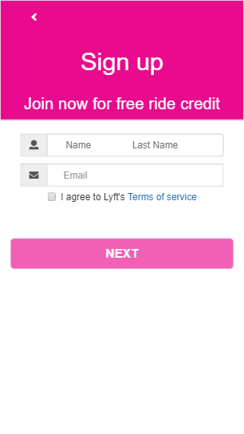

# LYFT APP

El siguiente proyecto es el desarrollo de una aplicación móvil Lyft se incluyo el device desktop, un servicio de taxi. La aplicación muestra el proceso de registro del usuario y la verificación de datos a registrar.

### Herramientas

- HTML5
- CSS3
- JavaScript
- Bootstrap v3
- jQuery

### 1 - Views

  
  
